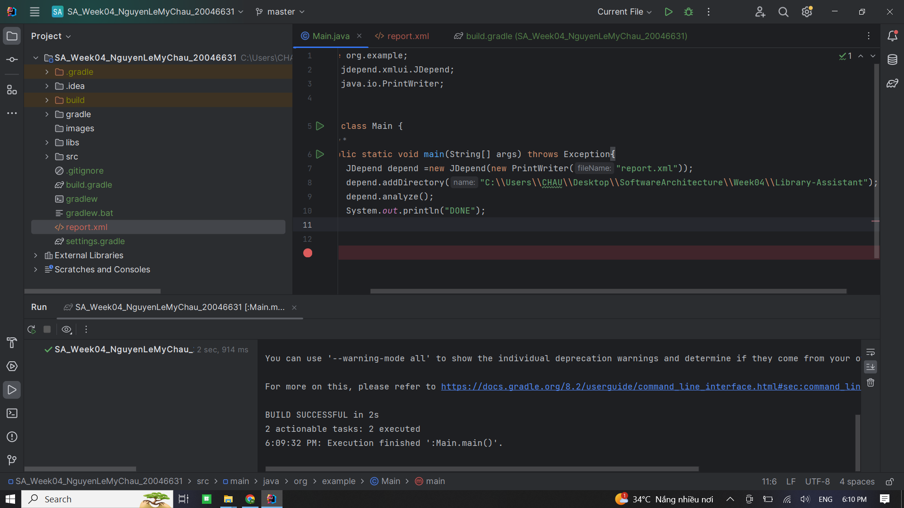

### SA_Week04_NguyenLeMyChau_20046631

#### Sử dụng
- JDK: Phiên bản 17.0.10
- Gradle Groovy
- jdepend-2.10.jar: <https://github.com/clarkware/jdepend/tree/master/dist>
- Library-Assistant: <https://github.com/afsalashyana/Library-Assistant.git>
- jdepend-ui: <https://github.com/ValentinaServile/jdepend-ui>

#### Công cụ

1. Report file XML using Jdepend

2. View Java Package Using UI

3. JDepend-UI: Use Jdepend-UI to generate the report

npm run jdepend-ui <path-to-xml-report-file> <your-packages-prefix>

